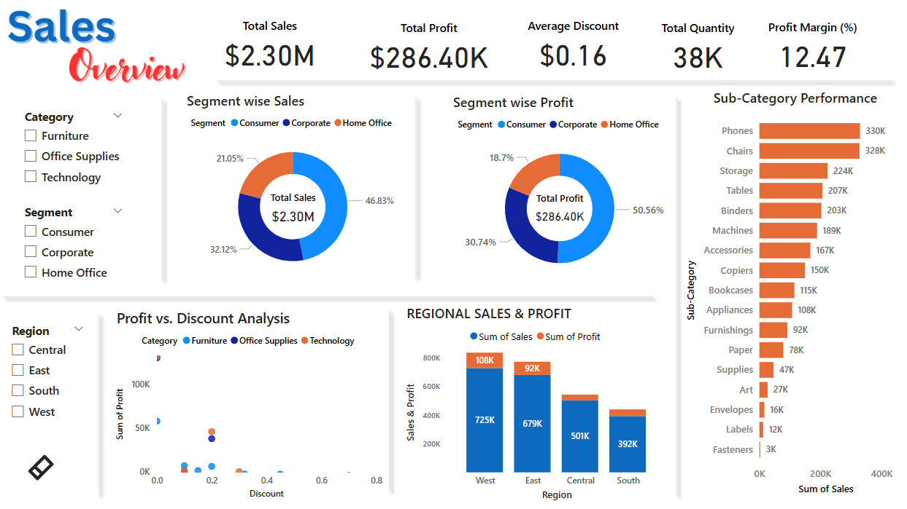

# Task2_Sales_Overview

## 📊 Sales Dashboard & Report – Power BI Project

This repository showcases a comprehensive sales analysis project built using **Power BI** and supplemented with a **PowerPoint report**. It covers sales performance metrics, regional breakdowns, segment analysis, discount impact, and more — aimed at providing actionable business insights.

### 🔍 Project Overview

This project analyzes and visualizes sales data to help stakeholders:

* Understand sales distribution across **segments** and **regions**
* Measure **profitability** and **performance** by **product sub-categories**
* Evaluate **discount strategies** using scatter plot analysis
* Gain insights into **high-performing categories and regions**

### 📸 Dashboard Features

* 📌 **KPIs**: Total Sales, Total Profit, Average Discount, Quantity Sold, Profit Margin
* 🧩 **Segment Analysis**: Donut charts for sales & profit by segment
* 📦 **Sub-Category Breakdown**: Horizontal bar chart of top/bottom performing sub-categories
* 📍 **Regional Sales & Profit**: Clustered bar chart across four regions
* 🔄 **Dynamic Filters**: Slicers for Category, Segment, and Region
* 📉 **Discount vs. Profit**: Scatter plot analysis for pricing strategies

### 📊 PowerPoint Report

The PowerPoint presentation provides a high-level summary of:

* Executive KPIs
* Visual insights from dashboard charts
* Key takeaways and recommendations
* Useful for stakeholder meetings and offline review

### 🛠 Tools Used

* **Power BI Desktop**
* **Microsoft PowerPoint** (for reporting)
* **DAX** (for calculated metrics)

